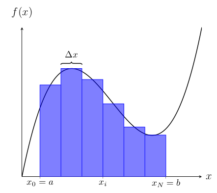

# Integración Numérica

Utilizando la interpretación geométrica de la *Integración de Riemann*, definida como el área bajo la curva de la función, es posible aproximar una integral definida utilizando una sumatoria de áreas de rectángulos de la siguiente forma:

$$
    \int_{a}^{b} f(x)\,dx \approx \sum_{i=0}^{N-1}f(x_i)\Delta x \approx \sum_{i=1}^{N}f(x_i)\Delta x,
$$

donde $x_i$ corresponden a los puntos dentro del intervalo $[a, b]$ donde se define la integral y $\Delta x = (b - a)/N$ el ancho de cada rectángulo. Es decir, se calcula el área de cada rectángulo como $f(x_i)\,\Delta x$ y luego se suman. Un esquema de la idea se presenta a continuación



Se puede notar que entre mayor sea el valor de $N$ el cálculo de la integral se hace de forma más precisa.

## Ejercicios

### Parte 1

Utilizando la información entregada anteriormente desarrolle un programa en Python que calcule el valor de la integral definida para las siguientes funciones:

- $f(x)=\sin(x) + x^2$
- $f(x)=x^5 + x^2 + e^{x}$
- $f(x)=\sin(x) / x$

donde $a$, $b$ y $N$ deben ser ingresados por el usuario.

??? danger "Solución"
    ```python
    --8<-- "python/ciclos/integral.py"
    ```


### Parte 2

Extienda la misma idea pero para aproximar la siguiente integral doble:

$$
\int_{a}^{b}\int_{c}^{d} f(x,y)\,dy\,dx \approx \sum_{i=0}^{N_x-1}\sum_{j=0}^{N_y-1}f(x_i, y_j)\Delta y \Delta x,\quad \Delta x = \frac{b - a}{N_x}, \quad \Delta y = \frac{d - c}{N_y}.
$$

Pruebe su programa calculando la siguiente integral doble 

$$\int_{0}^{1}\int_{0}^{1} -(x^2 + y^2)\,dy\,dx$$ 

sabiendo que el resultado es $-2/3$.

Pruebe otras funciones y verifique con la siguiente aplicación: [Wolfram Alpha](https://www.wolframalpha.com/input/?i=multiple+integral)

??? danger "Solución"
    ```python
    --8<-- "python/ciclos/integral_doble.py"
    ```