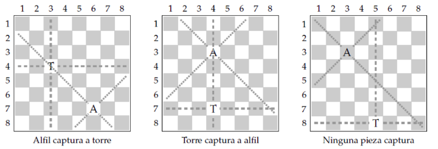

# Ajedrez

Un tablero de ajedrez es una grilla de ocho filas y ocho columnas, numeradas de $1$ a $8$. Dos de las piezas del juego de ajedrez son el alfil y la torre. El alfil se desplaza en diagonal, mientras que la torre se desplaza horizontal o verticalmente. Una pieza puede ser capturada por otra si está en una casilla a la cual otra puede desplazarse:



Escriba un programa que reciba como entrada las posiciones en el tablero de un alfil y de la torre, e indique cuál pieza captura a la otra. Suponga que todos los datos ingresados son válidos.

## Ejemplos

```
Fila alfil: 7
Columna alfil: 6
Fila torre: 4
Columna torre: 3
Alfil captura
```

```
Fila alfil: 3
Columna alfil: 4
Fila torre: 7
Columna torre: 4
Torre captura
```

```
Fila alfil: 3
Columna alfil: 3
Fila torre: 8
Columna torre: 5
Ninugna captura
```


??? danger "Solución"
    ```python
    --8<-- "python/condicionales/ajedrez.py"
    ```