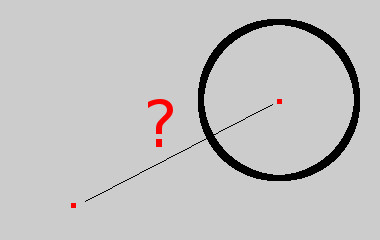

# Círculo

Dada las coordenadas del centro y el radio de un círculo, además de las coordenadas de un punto, queremos saber dónde está el punto respecto al círculo. ¿El punto está al interior, exterior o justo en la circunferencia?



Desarrolle un programa para resolver el problema planteado.

??? danger "Solución"
    ```python
    --8<-- "python/condicionales/circulo.py"
    ```