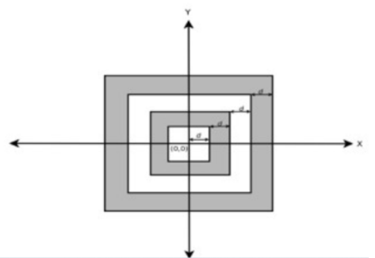

# Tiro al blanco

En un juego de video hay que dispararle a un tablero de tiro al blanco que se encuentra dado por cuatro áreas cuadradas concéntricas separadas por una distancia $d$ (igual para todas las áreas). Suponga que el tiro al blanco se encuentra en un plano cartesiano de dos dimensiones cuyo centro $(0,0)$ es el centro mismo del tiro al blanco.
Si las áreas concéntricas se enumeran desde la mas interna hasta la mas externa de $1$ a $4$, realice un programa en Python que retorne el número del área en la cual ha caído el disparo. El usuario debe ingresar la distancia $d$ y el punto $(x,y)$.



## Ejemplos

```
Ingrese la distancia: 5
Ingrese  x: 3
Ingrese  y: 4
Área 1
```

```
Ingrese la distancia: 1
Ingrese  x: 6
Ingrese  y: 6
Fuera del área
```


??? danger "Solución"
    ```python
    --8<-- "python/condicionales/tiro.py"
    ```