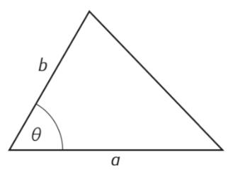

# Triángulos

## Perímetro

Tenemos un triángulo del cual conocemos las coordenadas de sus 3 vértices. Escriba un programa que calcule su perímetro. Este problema es una extensión del [ejercicio de distancia](./distancia.md).

### Ejemplo
```
Ingrese el valor de x1: 0
Ingrese el valor de y1: 0
Ingrese el valor de x2: 1
Ingrese el valor de y2: 0
Ingrese el valor de x3: 0
Ingrese el valor de y3: 1
El perímetro del triángulo es: 3.414213562373095
```

??? danger "Solución"
    ```python
    --8<-- "python/secuenciales/perimetro_triangulo.py"
    ```

## Área 1 

Realice un programa que calcule el área de un triángulo a partir de las longitudes de sus lados. Para calcularlo utilice la fórmula de Herón:

$$
    A = \sqrt{s\,(s-a)(s-b)(s-c)}
$$

donde $a$, $b$ y $c$ son las longitudes de cada lado y $s=\dfrac{a+b+c}{2}$ es el semiperímetro.

### Ejemplo

```
Ingrese longitud del lado a: 3
Ingrese longitud del lado b: 4
Ingrese longitud del lado c: 5
El área del triángulo es 6.0
```

??? danger "Solución"
    ```python
    --8<-- "python/secuenciales/triangulo_heron.py"
    ```

## Área 2

El área de un triángulo se puede calcular a partir del valor de dos de sus lados, $a$ y $b$, y del ángulo $\theta$ que estos forman entre sí con la fórmula 

$$
    A=\frac12a\,b\sin(\theta).
$$ 

Diseñe un programa que pida al usuario el valor de los dos lados (en metros), el ángulo que estos forman (en grados), y muestre el valor del área.



Considere que la función ```sin``` de Python trabaja en radianes, así que el ángulo que lea en grados debe convertirse a radianes. Utilice un redondeo de $2$ decimales al cálculo final del área.

### Ejemplo

```
Ingrese el valor del lado a (metros): 1
Ingrese el valor del lado b (metros): 2
Ingrese el valor del ángulo theta (grados): 30
El área del triángulo es: 0.5 metros cuadrados
```

??? danger "Solución"
    ```python
    --8<-- "python/secuenciales/triangulo_seno.py"
    ```